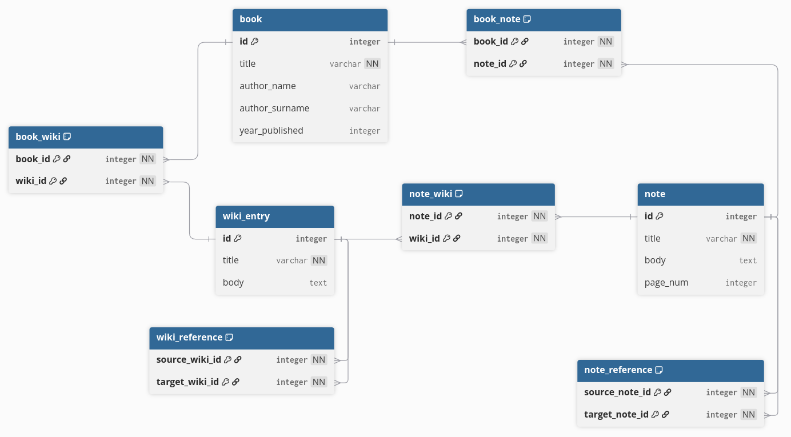

# mimir

A simple electron app for taking notes and building wikis to keep up with your favourite books and fictional worlds.

Project template is created using Electron Forge.

# Database

mimir's database consists of three main entities: books, notes and wiki entries.
Books can have multiple references to notes and wiki entries. Wiki entries can belong to multiple books because places and characters, among others, can appear in more than one books. On the other hand, a note can only be connected to a single book. However, notes can reference notes from other books.

This model is the foundation of mimir. Cross-referencing notes and wiki entries helps making a web of knowledge and reduces the sense of discontinuity that's often present with classical note-taking.

